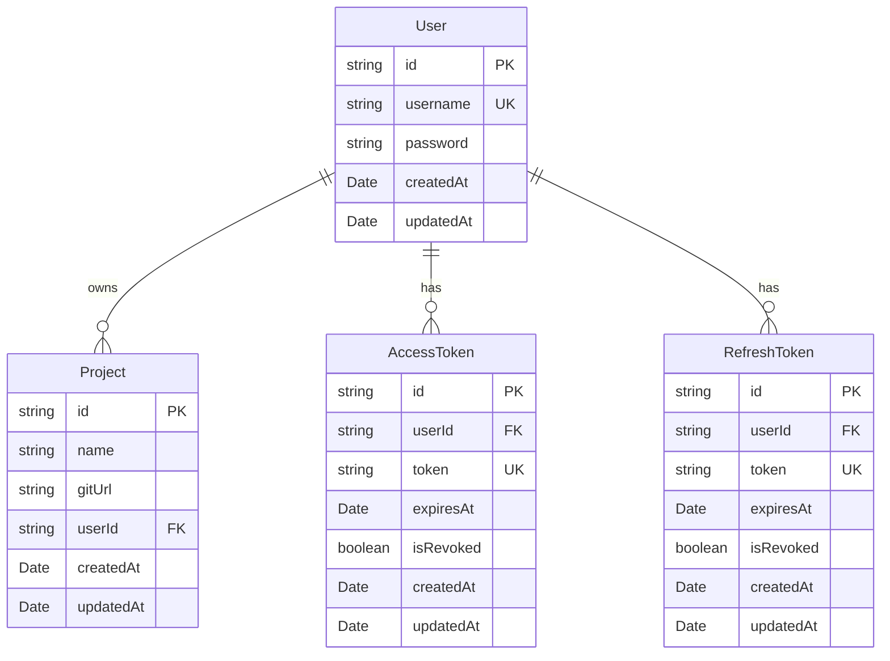

# Domain Layer

- [Architecture](#architecture)
- [Database Technology Agnostic Design](#database-technology-agnostic-design)
- [Entity Relationship Diagram](#entity-relationship-diagram)
- [Entity Descriptions](#entity-descriptions)
- [Data Access Objects (DAOs)](#data-access-objects-daos)
  - [Database Session Management](#database-session-management)
- [Domain Utilities](#domain-utilities)
- [Dependency Injection](#dependency-injection)
- [MongoDB Implementation](#mongodb-implementation)

## Architecture
The domain layer follows clean architecture principles with clear separation between:
- **Interfaces**: Define the business domain model and DAO contracts
- **Utils**: Database-agnostic utility functions for coordinated domain operations
- **MongoDB**: Concrete implementations for MongoDB database of both domain models and DAOs

## Database Technology Agnostic Design

If the separation principle is respected, it will be possible to implement database-agnostic business logic. Should it become necessary to change the database technology (e.g., from MongoDB to PostgreSQL, MySQL, or any other database), the change will be easy and will not require rewriting all the domain logic. 

Controllers and business logic remain completely independent from database implementation details by only depending on entity interfaces and DAO interfaces. The actual database-specific code is isolated in the implementation layer.

When writing tests, maintain this principle as much as possible.

## Entity Relationship Diagram

> **Note**: If the diagram below is not displayed correctly, install a Mermaid extension for your IDE to properly visualize Mermaid diagrams.

## Entity Descriptions

Detailed documentation for each entity is available in their respective interface files:

- **[User](./interfaces/entities/User.ts)** - Primary entity representing application users ([UserDAO](./interfaces/dao/UserDAO.ts))
- **[Project](./interfaces/entities/Project.ts)** - Business entity for user projects with Git repositories ([ProjectDAO](./interfaces/dao/ProjectDAO.ts))
- **[AccessToken](./interfaces/entities/AccessToken.ts)** - Authentication entity for JWT access tokens ([AccessTokenDAO](./interfaces/dao/AccessTokenDAO.ts))
- **[RefreshToken](./interfaces/entities/RefreshToken.ts)** - Authentication entity for JWT refresh tokens ([RefreshTokenDAO](./interfaces/dao/RefreshTokenDAO.ts))

Each entity file contains comprehensive documentation including field descriptions, constraints, relationships, and usage examples.

## Data Access Objects (DAOs)

DAOs provide an abstraction layer between the business logic and the database implementation. Each entity has its corresponding DAO interface that defines the available operations for data persistence and retrieval.

### Database Session Management

All write operations require a database session obtained through the `DatabaseSessionProducer` pattern. This abstraction ensures:

- **Atomicity**: All operations within a single API call are executed as a single transaction
- **Consistency**: Either all operations succeed or all fail, maintaining data integrity  
- **Database Agnostic**: The session management pattern works across different database technologies
- **Isolation**: Each API request operates in its own transaction context

The `DatabaseSessionProducer` creates database-specific sessions (e.g., MongoDB ClientSession) while maintaining the same interface contract. This allows controllers to remain database-agnostic while ensuring transactional consistency.

Read operations don't require sessions as they don't modify data, while all create, update, and delete operations use sessions to guarantee transactional integrity within each API call.

**Route Implementation**: In practice, routes use [`dbTransactionHandler`](../setup/middleware/errorHandler.ts) to automatically manage session lifecycle and transaction boundaries for write operations, while [`asyncHandler`](../setup/middleware/errorHandler.ts) handles read-only operations that don't require transactions.

## Domain Utilities

The [`utils/`](./utils/) directory contains database-agnostic utility functions that coordinate multiple domain operations while maintaining the same architectural principles as the rest of the domain layer.

### Database-Agnostic Design

Domain utilities follow the same database technology independence principles:

- **Interface Dependencies**: Only depend on DAO interfaces and domain entities, never on specific implementations
- **Session Management**: Accept `DatabaseSession` parameters for transactional consistency
- **Testability**: All dependencies are injected as parameters, enabling easy mocking in unit tests

## Dependency Injection

The domain layer uses a dependency injection pattern with four core components:

- **[ContainerDAO](./interfaces/ContainerDAO.ts)** - Central registry providing unified access to all DAOs
- **[DatabaseConnection](./interfaces/DatabaseConnection.ts)** - Manages database connectivity lifecycle  
- **[DatabaseSession](./interfaces/DatabaseSession.ts)** - Wraps database-specific sessions for transactions
- **[DatabaseSessionProducer](./interfaces/DatabaseSessionProducer.ts)** - Creates and manages session lifecycle

These components are instantiated and injected in `index.ts` and `app.ts` to wire up the application dependencies.

This architecture ensures loose coupling, testability, and easy database technology switching by injecting dependencies through constructor parameters rather than creating them directly.

## MongoDB Implementation

The [`mongodb/`](./mongodb/) directory contains the concrete implementation of all domain interfaces using MongoDB and Mongoose ODM. This implementation demonstrates the database-agnostic design in practice:

- **[Entities](./mongodb/entities/)** - MongoDB schemas that extend domain interfaces using `Omit<Entity, 'id'>` pattern to avoid ID conflicts
- **[DAOs](./mongodb/dao/)** - Concrete implementations that convert MongoDB documents to clean domain entities via `documentToEntity()` methods
- **[Infrastructure](./mongodb/)** - Database connection, session management, and container implementations for MongoDB

All MongoDB implementations maintain strict separation from business logic, ensuring controllers receive properly typed domain entities with non-nullable `id` fields while hiding database-specific details like `_id` ObjectIds and document methods.
